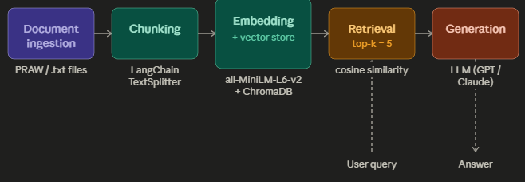

# Project 1 Planning: The Unofficial Guide

> Write this document before you write any pipeline code.
> Your spec and architecture diagram are what you'll use to direct AI tools (Claude, Copilot, etc.) to generate your implementation — the more specific they are, the more useful the generated code will be.
> Update the Retrieval Approach and Chunking Strategy sections if you change your approach during implementation.
> Update this file before starting any stretch features.

---

## Domain

<!-- What domain did you choose? Why is this knowledge valuable and hard to find through official channels? -->
Off-campus housing experiences for college students, with a focus on Binghamton University and the surrounding Vestal/Binghamton area. This domain covers topics like cost comparisons between on- and off-campus living, roommate dynamics, lease timing, neighborhood quality, and landlord experiences. This knowledge is hard to find in one place because it's scattered across Reddit threads, review sites, and word of mouth — and official university resources don't capture the candid, student-to-student advice about what living off-campus is actually like day to day.

---

## Documents

<!-- List your specific sources: URLs, subreddit names, forum threads, or file descriptions.
     Aim for at least 10 sources that together cover different subtopics or perspectives within your domain. -->

| # | Source | Description | URL or location |
|---|--------|-------------|-----------------|
| 1 | r/BinghamtonUniversity| | whats finding off campus housing like now | https://www.reddit.com/r/BinghamtonUniversity/comments/1rvqciw/whats_finding_off_campus_housing_like_now/
| 2 | r/BinghamtonUniversity| | is it better to live offcampus | https://www.reddit.com/r/BinghamtonUniversity/comments/17j9ml5/is_it_better_to_live_offcampus/
| 3 | r/BinghamtonUniversity| | off campus terrible roommate | https://www.reddit.com/r/BinghamtonUniversity/comments/1phlycj/off_campus_terrible_roommate/
| 4 | r/BinghamtonUniversity| | living offcampus | https://www.reddit.com/r/BinghamtonUniversity/comments/16f7af6/living_offcampus/
| 5 | r/BinghamtonUniversity| | off campus housing for 26 27 | https://www.reddit.com/r/BinghamtonUniversity/comments/1nc6xkk/off_campus_housing_for_2627/
| 6 | r/BinghamtonUniversity| | how much cheaper is it to live off campus | https://www.reddit.com/r/BinghamtonUniversity/comments/11tfz1t/how_much_cheaper_is_it_to_live_off_campus/
| 7 | r/BinghamtonUniversity| | my off campus experience | https://www.reddit.com/r/Binghamton/comments/1rjup0u/my_off_campus_experience/
| 8 | r/college| | off campus or on campus housing for first year | https://www.reddit.com/r/college/comments/gayjbc/off_campus_or_on_campus_housing_for_first_year/
| 9 | r/college| | why is the difference between on campus and off | https://www.reddit.com/r/college/comments/1n90nti/why_is_the_difference_between_on_campus_and_off/
| 10 | r/college| | off campus housing | https://www.reddit.com/r/college/comments/11yt9kx/off_campus_housing/

---

## Chunking Strategy

<!-- How will you split documents into chunks?
     State your chunk size (in tokens or characters), overlap size, and explain why those
     numbers fit the structure of your documents.
     A review-heavy corpus warrants different chunking than a long FAQ. -->

**Chunk size:**
~200 tokens (800 characters)

**Overlap:**
~30 tokens (120 characters)

**Reasoning:**
Reddit threads are made up of short, conversational comments — most individual replies are 1–4 sentences. The original spec targeted 300–400 tokens, but during implementation I discovered that all-MiniLM-L6-v2 has a hard 256-token input limit — chunks longer than that are silently truncated, losing content and degrading embedding quality. I revised the chunk size down to ~200 tokens (800 chars) to stay comfortably inside the model window. This also produces more chunks per document (~6–7 vs. ~3), giving the retrieval step more precise targets. A 30-token (120-char) overlap preserves continuity at comment boundaries without inflating chunk count.

---

## Retrieval Approach

<!-- Which embedding model are you using (e.g., all-MiniLM-L6-v2 via sentence-transformers)?
     How many chunks will you retrieve per query (top-k)?
     If you were deploying this for real users and cost wasn't a constraint, what tradeoffs
     would you weigh in choosing a different embedding model — context length, multilingual
     support, accuracy on domain-specific text, latency? -->

**Embedding model:**
all-MiniLM-L6-v2 (via sentence-transformers)

**Top-k:**
5

**Production tradeoff reflection:**
all-MiniLM-L6-v2 is fast and lightweight, which makes it practical for this project, but it has a limited context window (256 tokens) and is trained on general text rather than student housing discussions. In a real deployment where cost wasn't a constraint, I'd consider OpenAI's text-embedding-3-large for higher accuracy on nuanced queries, or a model with multilingual support if the user base included non-English speakers. The tradeoff is latency and cost — larger models are slower and more expensive per query. For a corpus this size, top-k=5 balances coverage without overwhelming the generation step with irrelevant chunks.

---

## Evaluation Plan

<!-- List your 5 test questions with their expected correct answers.
     Questions should be specific enough that you can judge whether the system's response
     is right or wrong. "What are good dining halls?" is too vague.
     "What do students say about wait times at [dining hall name] during lunch?" is testable. -->

| # | Question | Expected answer |
|---|----------|-----------------|
| 1 | When should I start looking for off-campus housing near Binghamton University? | Students recommend starting early — end of August/early fall is described as competitive and stressful |
| 2 | Is it cheaper to live off-campus than on-campus at BU? | Yes, off-campus is generally cheaper; students cite per-room costs around $450–$600/month depending on how many roommates you have |
| 3 | What are common problems students face with off-campus roommates at BU? | Conflicts over chores, noise, guests, and splitting utilities are commonly mentioned |
| 4 | What do students say about the experience of living off-campus for the first time? | Students mention freedom and lower cost but also unexpected responsibilities like dealing with landlords and utility bills |
| 5 | How do full-time students afford off-campus housing without working full-time? | Common answers include parental support, student loans, financial aid, and packing multiple roommates into cheaper units |

---

## Anticipated Challenges

<!-- What could go wrong? Name at least two specific risks with reasoning.
     Consider: noisy or inconsistent documents, missing source attribution, off-topic
     retrieval, chunks that split key information across boundaries. -->

1.
Noisy and off-topic comments:** Reddit threads often include jokes, tangential replies, and one-word responses that don't contain useful housing information. These low-signal chunks could get retrieved and confuse the generation step, producing vague or irrelevant answers. Filtering out very short chunks (under ~50 tokens) during ingestion may help.

2.
Chunks splitting key context across boundaries:** A comment that starts with "I lived on Vestal Parkway and..." might get cut before the useful advice appears in the next sentence. The 50-token overlap helps but won't fully solve this — some answers may feel incomplete if the most important part of a reply lands at a chunk boundary.

---

## Architecture

<!-- Draw a diagram of your pipeline showing the five stages:
     Document Ingestion → Chunking → Embedding + Vector Store → Retrieval → Generation
     Label each stage with the tool or library you're using.
     You can use ASCII art, a Mermaid diagram, or embed a sketch as an image.
     You'll use this diagram as context when prompting AI tools to implement each stage. -->

---

## AI Tool Plan

<!-- For each part of the pipeline below, describe:
     - Which AI tool you plan to use (Claude, Copilot, ChatGPT, etc.)
     - What you'll give it as input (which sections of this planning.md, which requirements)
     - What you expect it to produce
     - How you'll verify the output matches your spec

     "I'll use AI to help me code" is not a plan.
     "I'll give Claude my Chunking Strategy section and ask it to implement chunk_text()
     with my specified chunk size and overlap" is a plan. -->

**Stage 1 — Document Ingestion:**
- Tool: Claude
- Input: List of 10 Reddit URLs and the requirement to save each as a plain .txt file
- Expected output: A Python script that fetches and saves each thread using PRAW or requests
- Verification: Check that each .txt file contains the post title, body, and at least the top comments

**Stage 2 — Chunking:**
- Tool: Claude
- Input: The Chunking Strategy section of this file plus a sample .txt document
- Expected output: A `chunk_text()` function using LangChain's RecursiveCharacterTextSplitter with chunk_size=400 and overlap=50
- Verification: Print chunk count and spot-check that no chunk is under 50 tokens or over 450 tokens

**Stage 3 — Embedding + Vector Store:**
- Tool: Claude
- Input: The Retrieval Approach section and the output of Stage 2
- Expected output: A script that embeds all chunks using all-MiniLM-L6-v2 and stores them in ChromaDB
- Verification: Query the vector store manually with a test string and confirm it returns 5 relevant chunks

**Stage 4 — Retrieval:**
- Tool: Copilot
- Input: The vector store from Stage 3 and a query string
- Expected output: A `retrieve()` function that takes a question and returns the top-5 most similar chunks
- Verification: Run each of the 5 evaluation questions and confirm the returned chunks are on-topic

**Stage 5 — Generation:**
- Tool: Claude
- Input: Retrieved chunks from Stage 4 plus a prompt template instructing the model to answer only from the provided context
- Expected output: A `generate_answer()` function that passes chunks + question to an LLM and returns a grounded answer
- Verification: Run the full pipeline on all 5 evaluation questions and compare outputs to expected answers in the Evaluation Plan

**Milestone 3 — Ingestion and chunking:**

**Milestone 4 — Embedding and retrieval:**

**Milestone 5 — Generation and interface:**
